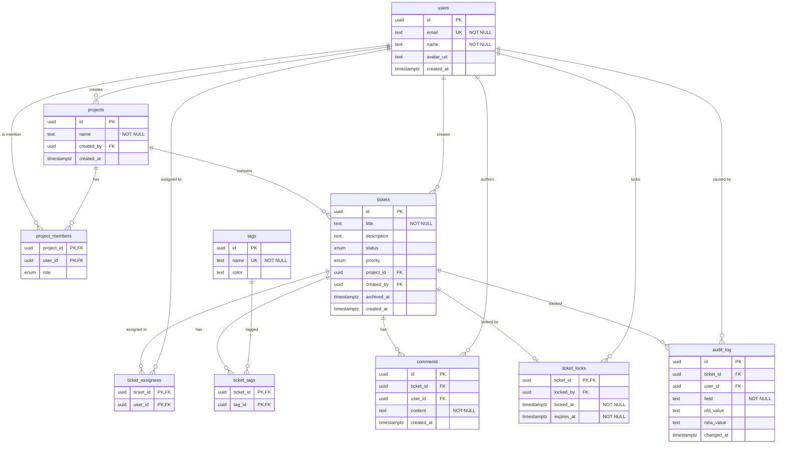

# Documentación de la Base de Datos

## Diagrama Entidad-Relación (ERD)

## Columnas Clave y Restricciones

| Tabla | Columna | Tipo | Restricción | Descripción |
| --- | --- | --- | --- | --- |
| `users` | `id` | uuid | PK | Identificador único del usuario. |
| `users` | `email` | text | NOT NULL, UNIQUE | Correo electrónico, debe ser único. |
| `projects` | `id` | uuid | PK | Identificador del proyecto. |
| `projects` | `created_by` | uuid | FK (`users.id`) | Relaciona al usuario creador. |
| `project_members` | `project_id`, `user_id` | uuid | PK, FK | Relación muchos a muchos para miembros del proyecto. |
| `tickets` | `id` | uuid | PK | Identificador único del ticket. |
| `tickets` | `title` | text | NOT NULL (MAX 255) | Título principal. |
| `tickets` | `project_id` | uuid | FK (`projects.id`) | Proyecto al que pertenece. |
| `ticket_locks` | `ticket_id` | uuid | PK, FK | Ticket bloqueado actualmente. |
| `audit_log` | `id` | uuid | PK | Registro de la auditoría. |

## Decisiones de Diseño

1. **Soft Delete (`archived_at` en `tickets`)**:
   Los tickets no se eliminan físicamente (hard delete) para mantener consistencia histórica, sino que se marcan con una marca de tiempo en `archived_at`.

2. **Pessimistic Lock (`ticket_locks`)**:
   Se utiliza para la edición colaborativa o concurrente de tickets. Permite bloquear un ticket por un usuario específico (registrado en `locked_by`). El bloqueo expira automáticamente (`expires_at`), lo que evita interbloqueos si el usuario abandona la sesión (tiempo de expiración: 15 mins).

3. **AuditLog Inmutable (`audit_log`)**:
   Tabla de solo inserción (append-only) que rastrea de manera estricta los cambios de estado y campos específicos. Esto asegura un historial confiable a nivel de modificaciones sin la posibilidad de alterar dichos registros pasados.
