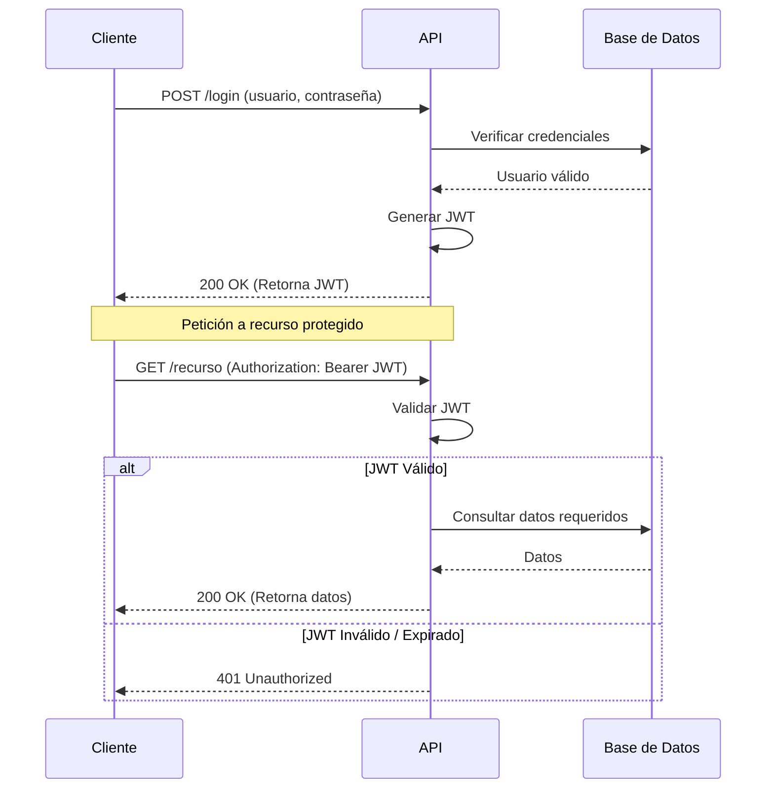
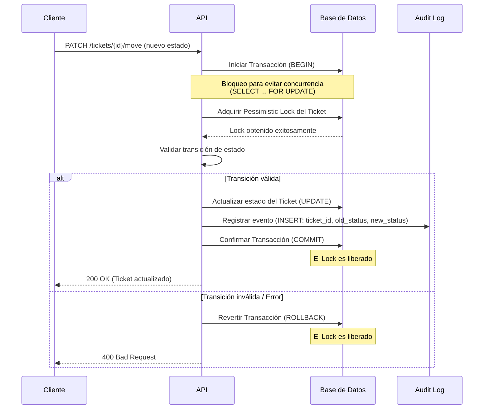

# Diagramas del Sistema Mini Jira

## 1. Flujo de Autenticación JWT

Este diagrama de secuencia muestra el proceso de inicio de sesión mediante credenciales y el uso posterior del JSON Web Token (JWT) para acceder a recursos protegidos.



## 2. Movimiento de Ticket con Lock Pesimista y Registro en AuditLog

Este diagrama de secuencia ilustra cómo un ticket es movido entre columnas, asegurando la consistencia transaccional mediante un bloqueo pesimista (Pessimistic Lock) y dejando un rastro en el registro de auditoría (`AuditLog`).



## 3. Ciclo de Vida de un Ticket

El siguiente diagrama de flujo muestra los posibles estados de un ticket (TODO, IN_PROGRESS, DONE) y los nodos intermedios que representan el intento de adquirir un Lock Pesimista durante la transición.

```mermaid
flowchart LR
    Start([Creación]) --> TODO[Por Hacer (TODO)]

    TODO --> TryLock1{Pessimistic<br/>Lock}
    TryLock1 -- "Éxito" --> IN_PROGRESS[En Progreso (IN_PROGRESS)]
    TryLock1 -- "Fallo/Ocupado" --> TODO

    IN_PROGRESS --> TryLock2{Pessimistic<br/>Lock}
    TryLock2 -- "Éxito" --> DONE[Listo (DONE)]
    TryLock2 -- "Fallo/Ocupado" --> IN_PROGRESS
    
    IN_PROGRESS --> TryLock3{Pessimistic<br/>Lock}
    TryLock3 -- "Éxito" --> TODO
    TryLock3 -- "Fallo/Ocupado" --> IN_PROGRESS

    DONE --> TryLock4{Pessimistic<br/>Lock}
    TryLock4 -- "Éxito" --> IN_PROGRESS
    TryLock4 -- "Fallo/Ocupado" --> DONE
```
